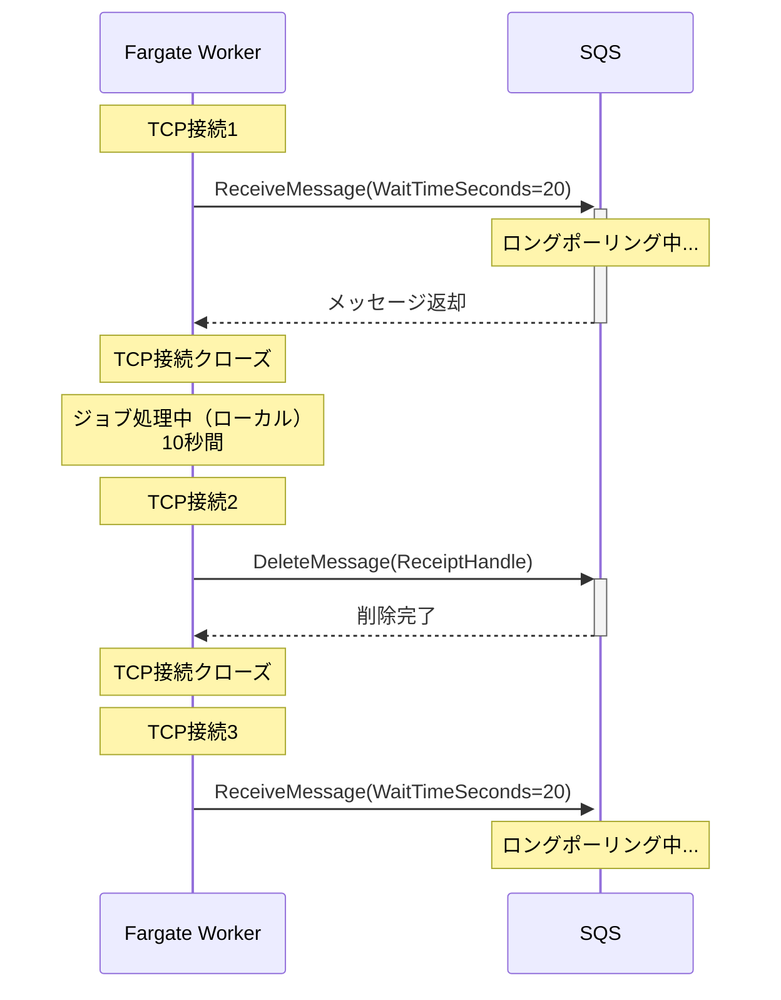
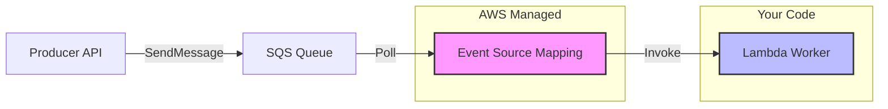
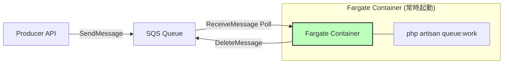
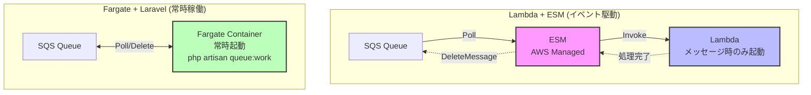
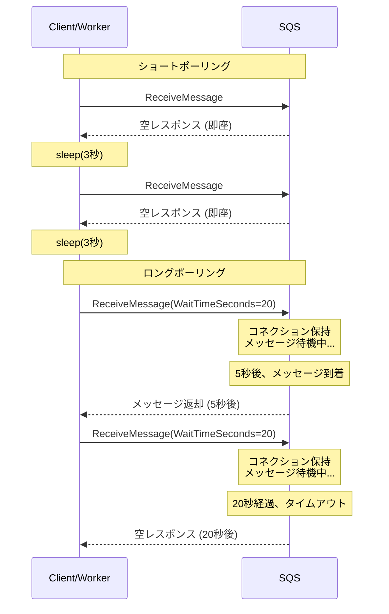
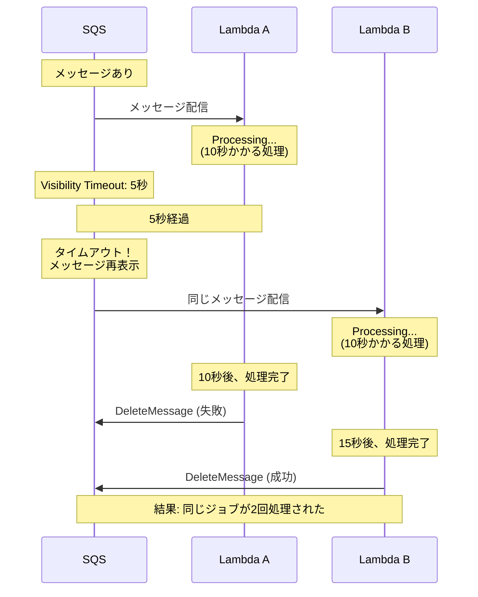
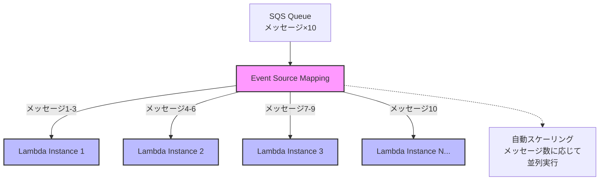

# SQS/SNS/Lambda 学習ノート

## README.mdの問題への考察と評価

### 1. なぜSQSはPushではなくPullモデルなのか？

#### Lambdaを動かしながら感じたことや示唆したこと
- **Scalability & Availability**
  - Pull型にすることで、リソースに余裕があるWorkerがメッセージを捌くことができる
  - Workerが捌けないときは、Workerとコミュニケーションを取らずともSQSにジョブを保持できる
  - Pull型なのでリクエストを受けてジョブをレスポンスして、Workerで処理をしている間にVisibility Timeoutで重複処理を防げる（整合性というのか？二重に処理しなくて済むという意味で整合性と書いた）
  - Push型だと、Workerのレスポンスに依存して、そのような機構の構築が難しそう

#### ClaudeCodeの補足解説

**素晴らしい理解です！** 以下、いくつか補足します：

1. **「整合性」という言葉について**
   - 「二重処理を防ぐ」という意味では**「冪等性（Idempotency）の保証」**や**「重複排除（Deduplication）」**という表現が正確です
   - ただし、「処理の整合性」という表現も間違いではありません。メッセージ処理の一貫性を保つという意味で通じます

2. **Push型の課題（補足）**
   ```
   Push型の場合:
   SQS → Worker（送信）

   問題:
   - Workerがダウンしていたら？ → メッセージロスト
   - Workerが遅い場合は？ → SQSが待つ必要がある
   - Worker側で再試行制御が必要 → 複雑
   ```

   ```
   Pull型の場合:
   Worker → SQS（取得）

   利点:
   - Workerが準備できた時に取得 → バックプレッシャー対応
   - Workerがダウンしても、SQSにメッセージが残る → 可用性
   - Visibility Timeoutで自動再試行 → シンプル
   ```

3. **バックプレッシャー（Back Pressure）対応**
   - Pull型により、Workerが自分のペースでメッセージを取得できる
   - これを**「バックプレッシャー」**と呼びます
   - システムが過負荷になるのを防ぐ重要な概念

4. **デカップリング（疎結合、Decoupling）の具体例**

   **Push型（密結合）の場合:**
   ```
   ┌─────┐                      ┌──────────┐
   │ SQS │ ─Push─> メッセージ送信 │ Worker A │
   └─────┘         ↓            └──────────┘
                   失敗

   問題:
   - SQSはWorker AのIPアドレス/URLを知る必要がある
   - Worker Aがダウンしていたら？
   - Worker Aが遅かったら？
   - Worker Aを増やすには？ → SQS側の設定変更が必要
   ```

   **Pull型（疎結合）の場合:**
   ```
   ┌─────┐
   │ SQS │ ← メッセージ取得 ← Worker A
   └─────┘ ← メッセージ取得 ← Worker B
           ← メッセージ取得 ← Worker C

   SQSは何も知らない:
   - Workerが何台あるか知らない
   - Workerがどこにいるか知らない
   - Workerが生きているか知らない
   - Workerの負荷状況を知らない
   ```

   **実際のシナリオ:**

   **シナリオ1: Workerをスケールアウト**
   - Push型: SQSの設定に新しいWorkerのURLを追加する必要がある
   - Pull型: 新しいWorkerを起動するだけ。SQSは何もしなくていい

   **シナリオ2: Workerがダウン**
   - Push型: SQSがタイムアウト・リトライ処理を実装する必要がある
   - Pull型: ダウンしたWorkerは取得しないだけ。他のWorkerが自動的に処理

   **シナリオ3: 異なるインフラでのWorker**
   ```
   Pull型だと、これが可能:
   ┌─────┐
   │ SQS │ ← Lambda Worker (AWS)
   └─────┘ ← Fargate Worker (AWS)
           ← EC2 Worker (AWS)
           ← オンプレミス Worker (自社データセンター)
           ← Kubernetes Worker (GCP)

   全部が同じSQSキューから取得可能！
   SQSは各Workerがどこにいるか知らない
   ```

   **まとめ表:**

   | 項目 | SQSが知る必要があるか |
   |------|---------------------|
   | Workerの台数 | ✗ 知らない |
   | Workerの場所（IP/URL） | ✗ 知らない |
   | Workerの負荷状況 | ✗ 知らない |
   | Workerが生きているか | ✗ 知らない |
   | Workerのスケーリング | ✗ 知らない |

   **デカップリングの利点:**
   - Workerを自由にスケールアウト/イン可能
   - Workerを自由に配置可能（AWS/GCP/オンプレミス）
   - Workerがダウンしても、SQS側は何もしなくていい
   - インフラ変更がWorker側だけで完結

**追加の考察：**
- **Pull型のトレードオフ**: ポーリングのオーバーヘッド（ロングポーリングで軽減）
- **Push型が適している場合**: WebhookやWebSocketなど、リアルタイム性（Real-time性、Low Latency）が最重要な場合

### ロングポーリングとTCP接続・非同期I/O

#### ロングポーリング中のTCP接続

**事実: ロングポーリング中、TCP接続は占有される**

```
Worker                    SQS
  │                        │
  │ TCP接続確立            │
  ├───────────────────────>│
  │ ReceiveMessage(20s)    │
  ├───────────────────────>│
  │                        │
  │   <<<< 20秒間保持 >>>> │ ← TCP接続が占有
  │                        │
  │ メッセージ or 空        │
  │<───────────────────────┤
  │ TCP接続クローズ         │
```

#### 同時接続数の比較（Worker 1000台の場合）

```
ショートポーリング:
- 平均接続時間: 100ms
- 1分間のリクエスト: 20,000回（1000台 × 20回）
- 平均同時接続数: 33個
- API処理回数: 20,000回/分

ロングポーリング:
- 平均接続時間: 10秒
- 1分間のリクエスト: 3,000回（1000台 × 3回）
- 平均同時接続数: 500個
- API処理回数: 3,000回/分
```

**疑問: ロングポーリングの方が同時接続数が多いのに、なぜ推奨される？**

#### 答え: 非同期I/Oとボトルネックの違い

**1. 非同期I/O（Async I/O）とは**

```javascript
// 同期I/O（ブロッキング）- 古いサーバーモデル
function handleRequest(connection) {
  // 1スレッドが1接続に占有される
  sleep(20);  // ← この間、スレッドがブロック（CPUは待機状態）
  return response;
}

問題:
- 1000接続 = 1000スレッド必要
- スレッド1つ = 数MB〜数十MBのメモリ
- コンテキストスイッチのオーバーヘッド
```

```javascript
// 非同期I/O（ノンブロッキング）- 現代のサーバーモデル
async function handleRequest(connectionId) {
  // タイマーを設定して、すぐに制御を返す
  const timeout = setTimeout(() => {
    sendResponse(connectionId);
  }, 20000);

  // ← スレッドは他の処理へ（ブロックされない）

  // メッセージが来たら即座に応答
  eventEmitter.once('message', (msg) => {
    clearTimeout(timeout);
    sendResponse(connectionId, msg);
  });
}

利点:
- 1スレッドで数万の接続を処理可能
- 接続1つ = 数KB〜数十KBのメモリ
- CPUリソースをほぼ消費しない（待機中）
```

**図解:**

```
同期I/O（ブロッキング）:
Thread 1 ─── Connection 1 [||||||||待機中||||||||]
Thread 2 ─── Connection 2 [||||||||待機中||||||||]
Thread 3 ─── Connection 3 [||||||||待機中||||||||]
...
Thread 1000 ─ Connection 1000 [||||||||待機中||||||||]

1000個のスレッド = 数GB〜数十GBのメモリ


非同期I/O（ノンブロッキング）:
Thread 1 ─┬─ Connection 1 [待機登録]
          ├─ Connection 2 [待機登録]
          ├─ Connection 3 [待機登録]
          └─ ...
             Connection 1000 [待機登録]

1個のスレッド = 数MB + (1000 × 数KB) のメモリ
```

**2. API処理のコスト**

各リクエストごとに実行される処理:

```
1. TCP接続の受け入れ（軽い）
   ↓
2. TLS/SSL ハンドシェイク（軽い）
   ↓
3. 認証・署名検証（重い）← AWS署名v4の検証
   ↓
4. リクエスト解析（中程度）
   ↓
5. キューからメッセージ検索（重い）← 分散システムへのクエリ
   ↓
6. レスポンス生成（軽い）
   ↓
7. ログ記録（中程度）
   ↓
8. 課金計算（軽い）
   ↓
9. メトリクス記録（軽い）
```

**コスト比較表:**

| 処理 | 同期I/O | 非同期I/O | API処理 |
|------|---------|-----------|---------|
| **リソース** | スレッド/メモリ | メモリのみ | CPU/DB/ネットワーク |
| **スケール** | 数千まで | 数万〜数百万 | リクエスト数に比例 |
| **コスト** | 接続数に比例 | 接続数に弱い比例 | **リクエスト数に強く比例** |

**3. なぜロングポーリングが推奨されるか**

```
ショートポーリング:
- 同時接続数: 33個（軽い）
- API処理回数: 20,000回/分（重い）← ボトルネック
- コスト: $0.40/100万リクエスト

ロングポーリング:
- 同時接続数: 500個（非同期I/Oで処理可能）
- API処理回数: 3,000回/分（軽い）← ここが重要
- コスト: ほぼ無料枠内
```

**ボトルネックの正体:**

```
❌ 間違った理解:
   「接続数が多い = 負荷が高い」

✅ 正しい理解:
   「API処理回数が多い = 負荷が高い」

理由:
- 非同期I/Oにより、接続保持は安価
- 認証・DB検索・ログなどの処理が高コスト
- リクエスト数を減らすことが最重要
```

**4. C10K問題との関連**

**C10K問題（2000年代初頭）:**
- 「1万個の同時接続を処理できるか？」
- 当時の同期I/Oサーバーの限界

**解決策（非同期I/O）:**
- epoll（Linux）、kqueue（BSD）
- イベント駆動アーキテクチャ
- Nginx、Node.js、Go などが採用

**現代（2020年代）:**
- C10K問題は解決済み
- C10M（1000万接続）も可能
- SQSは数百万〜数千万の同時接続に対応

**5. まとめ**

| 項目 | 説明 |
|------|------|
| **TCP接続占有** | Yes、ロングポーリング中は20秒間占有 |
| **同時接続数** | ロングポーリングの方が多い（33 → 500） |
| **なぜ問題ない？** | 非同期I/Oで接続は安価に処理できる |
| **本当のボトルネック** | API処理回数（認証、DB検索、ログなど） |
| **ロングポーリングの利点** | API処理回数が激減（20,000 → 3,000） |
| **結論** | 接続数よりもリクエスト総数を減らすことが重要 |

**キーポイント:**
- **接続保持コスト（非同期I/O）<< API処理コスト**
- ロングポーリングは「同時接続数は増えるが、リクエスト総数は激減」
- SQSのような大規模サービスでは、非同期I/Oにより接続数はスケールの制約にならない

#### 補足: 空リクエストでもコストは変わらない

**よくある誤解:**
> 「メッセージがなければ、ショートポーリングでもSQSにとっては軽いのでは？」

**実際:**
**メッセージの有無に関わらず、リクエストごとの処理コストはほぼ同じ**

**1. API処理は「メッセージの有無に関わらず」実行される**

```
空リクエストの場合でも:

1. TCP接続の受け入れ ✓
2. TLS/SSL ハンドシェイク ✓
3. 認証・署名検証 ✓ ← 重い（毎回実行）
4. リクエスト解析 ✓
5. キューからメッセージ検索 ✓ ← 重い（DBクエリは実行される）
6. 空レスポンス生成 ✓
7. ログ記録 ✓
8. 課金計算 ✓
9. メトリクス記録 ✓

→ メッセージがなくても、ほぼ同じコスト！
```

**DB検索の例:**
```sql
-- SQSの内部DB（概念的）
SELECT * FROM messages
WHERE queue_id = 'BasicQueue'
  AND visibility = TRUE
  AND receive_count < max_receives
LIMIT 10;

結果: 0件 ← メッセージがなくてもクエリコストはかかる
```

**コスト比較:**
- メッセージあり: 認証(100ms) + DBクエリ(50ms) + レスポンス生成(10ms) = 160ms
- メッセージなし: 認証(100ms) + DBクエリ(50ms) + 空レスポンス(10ms) = 160ms
- **差はほぼない！**

**2. AWS料金体系が証明している**

```
SQS料金:
- リクエスト数で課金（メッセージの有無は関係ない）
- 100万リクエストあたり $0.40

例:
- 100万回のReceiveMessage（全部空）: $0.40
- 100万回のReceiveMessage（全部メッセージあり）: $0.40

→ 同じ料金 = コストは同じ
```

**もし空リクエストが軽いなら:**
```
仮想的な料金体系（こうはなっていない）:
- メッセージありリクエスト: $0.40/100万
- メッセージなしリクエスト: $0.10/100万 ← こうなるはず

でも実際は同じ料金 → 空リクエストも同じコスト
```

**3. CPU時間の詳細比較**

**ショートポーリング（メッセージなし）:**
```
1分間に20,000回のリクエスト

各リクエスト:
- 認証検証: 100ms
- DB検索: 50ms
- 空レスポンス: 10ms
- 合計: 160ms

総CPU時間: 20,000 × 160ms = 53分相当
```

**ロングポーリング（メッセージなし）:**
```
1分間に3,000回のリクエスト

各リクエスト（20秒待機）:
- 認証検証: 100ms
- 初回DB検索: 50ms
- 20秒待機中に5秒ごとDB検索: 50ms × 4回 = 200ms
- 空レスポンス: 10ms
- 合計: 360ms（20秒中）

総CPU時間: 3,000 × 360ms = 18分相当

※ 20秒待機しているが、実際のCPU時間は360msのみ（非同期I/O）
```

**効率比較:**
- ショートポーリング: 53分相当のCPU時間
- ロングポーリング: 18分相当のCPU時間
- **ロングポーリングは約3倍効率的**

**4. なぜ「20秒待機」はコストが低いのか**

```javascript
// ロングポーリングの内部実装（概念的）
async function longPolling(request) {
  // 初回検索（コストあり）
  let messages = await db.query("SELECT ...");
  if (messages.length > 0) return messages;

  // 20秒間、定期的にチェック（5秒ごと）
  for (let i = 0; i < 4; i++) {
    await sleep(5000); // ← CPU時間ゼロ（非同期）
    messages = await db.query("SELECT ...");
    if (messages.length > 0) return messages;
  }

  return []; // 空レスポンス
}

実際のCPU時間:
- 初回クエリ: 50ms
- 5秒ごとのクエリ（4回）: 200ms
- 合計: 250ms

20秒待機しているが、CPU時間は250msのみ！
```

**ショートポーリングとの比較（20秒間）:**
```javascript
// ショートポーリングで20秒間
20秒 / 3秒sleep = 約7回のリクエスト

各リクエスト:
- 認証: 100ms
- クエリ: 50ms
- 合計: 150ms × 7回 = 1,050ms

→ ロングポーリング（250ms）の4倍のCPU時間！
```

**5. SQS全体への影響**

```
SQS内部構造（簡略化）:

┌─────────────┐
│ API Layer   │← 認証・リクエスト解析
├─────────────┤
│ Queue Layer │← メッセージ検索ロジック
├─────────────┤
│ Storage     │← 分散DB
└─────────────┘

ショートポーリング（メッセージなし）:
- API Layer: 20,000回/分の処理
- Queue Layer: 20,000回/分のクエリ
- Storage: 20,000回/分の読み取り

ロングポーリング（メッセージなし）:
- API Layer: 3,000回/分の処理
- Queue Layer: 約12,000回/分のクエリ（5秒ごと × 4回）
- Storage: 12,000回/分の読み取り

→ 全レイヤーで負荷が低い
→ 特にAPI Layerの負荷が1/6以下
```

**6. 統合まとめ表**

| 観点 | ショートポーリング | ロングポーリング | 結論 |
|------|------------------|----------------|------|
| **同時接続数** | 33個 | 500個 | ロングが多い |
| **リクエスト総数** | 20,000回/分 | 3,000回/分 | ロングが少ない |
| **API処理回数** | 20,000回/分 | 3,000回/分 | ロングが少ない |
| **DB検索回数** | 20,000回/分 | 12,000回/分 | ロングが少ない |
| **CPU時間（空）** | 53分相当 | 18分相当 | ロングが効率的 |
| **コスト** | $0.40/100万req | $0.40/100万req | 総リクエスト数で決まる |
| **接続保持** | 短い（100ms） | 長い（20秒） | 非同期I/Oで問題なし |

**7. 最終的な理解**

```
❌ 間違った理解:
   1. 「接続数が多い = 負荷が高い」
   2. 「メッセージがない = 処理コスト低い」
   3. 「ショートポーリングでもメッセージなければ軽い」

✅ 正しい理解:
   1. 接続数 << API処理回数（非同期I/Oで接続は安価）
   2. メッセージの有無に関わらず処理コストはほぼ同じ
   3. リクエスト総数を減らすことが最重要

理由:
- 非同期I/Oにより、接続保持は極めて安価
- 認証・DB検索・ログ記録は毎回実行される
- メッセージがなくてもDBクエリコストはかかる
- AWS料金体系が「リクエスト数」で課金している事実が証明
```

**キーインサイト:**
- **SQSのボトルネック = リクエスト処理の回数**
- **メッセージの有無は関係ない**
- **ロングポーリングは「接続は増えるが、リクエスト総数と処理回数が激減」**
- **これが圧倒的に効率的**

#### 直感的な見分け方: 同時接続数 vs リクエスト数、どちらがボトルネック？

**重要なスキル:** システムの性質を見極めて、どこが本当のボトルネックかを判断する

**判断基準: 「I/Oモデル」と「処理の重さ」**

---

**1. シンプルな判断フローチャート**

```
質問1: サーバーは非同期I/O（Async I/O）を使っている？
  ├─ Yes → 同時接続数は問題になりにくい
  └─ No  → 同時接続数がボトルネックになりやすい

質問2: 各リクエストで重い処理をしている？
  ├─ Yes（認証、DB検索、計算など）→ リクエスト数がボトルネック
  └─ No（静的ファイル返すだけなど）  → 同時接続数がボトルネック
```

**組み合わせ:**

| I/Oモデル | 処理の重さ | ボトルネック | 例 |
|-----------|-----------|-------------|-----|
| 同期I/O | 軽い | **同時接続数** | Apache（古い設定） |
| 同期I/O | 重い | **両方** | 従来型のWebアプリ |
| 非同期I/O | 軽い | **ネットワーク帯域** | Nginx（静的ファイル） |
| 非同期I/O | 重い | **リクエスト数** | SQS、API Gateway |

---

**2. 具体的な見分け方**

**A. サーバーの実装を見る**

```python
# 同期I/O（スレッドモデル）
# → 同時接続数がボトルネック
def handle_request(request):
    time.sleep(20)  # 接続を20秒保持
    return response

問題: 1000接続 = 1000スレッド
```

```javascript
// 非同期I/O（イベント駆動）
// → 同時接続数は問題になりにくい
async function handleRequest(connectionId) {
    await sleep(20000);  // 接続を20秒保持
    return response;
}

問題なし: 1000接続でも1スレッド
```

**キーワードで判断:**
- **同期I/O系:** Apache（prefork）、PHP-FPM、古いJavaサーバー
- **非同期I/O系:** Nginx、Node.js、Go、Rust（tokio）、Python（asyncio）

**B. 処理内容を見る**

```
軽い処理（リクエスト数の影響小）:
- 静的ファイルを返す
- メモリキャッシュから返す
- 単純なプロキシ

重い処理（リクエスト数の影響大）:
- 認証・署名検証
- DB検索
- 外部API呼び出し
- 複雑な計算
- ログ書き込み
```

---

**3. ボトルネック判定の一般式**

**⚠️ 用語の明確化**

この式で使う「リクエスト数」は**スループット（req/sec）**を指します：

```
スループット（Throughput）:
- 単位時間あたりの総リクエスト数
- 単位: req/sec
- 例: 1秒間に100リクエスト処理 = 100 req/sec

同時リクエスト数（Concurrent Requests）:
- ある瞬間に処理中のリクエスト数
- 単位: 個
- 例: 30個のリクエストが同時に処理中

関係式:
同時リクエスト数 = スループット × 処理時間
```

**具体例（SQS）:**
```
スループット: 22 req/sec
処理時間: 0.36秒
同時リクエスト数: 22 × 0.36 ≈ 8個

→ 8コアで各コアが1リクエストずつ処理している状態
```

---

**⚠️ 重要: 接続時間の長さ ≠ 処理の重さ**

SQSロングポーリング例:
```
接続時間: 20秒（長い）
実CPU時間: 360ms（短い） ← 19.64秒はasync待ち
```

**判定式:**

```
T_conn = MaxConnections / ConnectionTime        # 最大スループット（同時接続限界）
T_cpu = (Cores × 1000ms) / ProcessingTime      # 最大スループット（CPU処理限界）

※ T_conn、T_cpu の単位は両方とも req/sec

if T_conn < T_cpu:
    ボトルネック = "同時接続数"
else:
    ボトルネック = "スループット(CPU処理)"
```

**実例計算:**

| システム | T_conn (req/sec) | T_cpu (req/sec) | ボトルネック |
|---------|-----------------|----------------|------------|
| **SQS** | 10,000/20 = 500 | 8000/360 = 22 | スループット |
| **WebSocket** | 10,000/3600 = 2.8 | 8000/10 = 800 | 同時接続数 |
| **REST API** | 10,000/0.1 = 100k | 8000/300 = 27 | スループット |

**パラメータ説明:**
```
MaxConnections: 最大同時接続数（例: 10,000）
ConnectionTime: 1接続の保持時間（秒）
Cores: CPUコア数（例: 8）※実環境に合わせて調整
ProcessingTime: 1リクエストのCPU処理時間（ms）
```

**簡易判定（暗算用）:**
```
R = T_conn / T_cpu

R >> 10:  CPU処理がボトルネック（スループット律速）
R ≈ 1:    両方考慮
R << 0.1: 同時接続数がボトルネック

例: SQS = 500/22 = 22.7 → CPU処理がボトルネック
```

---

**4. 実践的な判断フロー**

**ステップ1: 処理内容を見る（最重要）**
```
重い処理（認証/DB/外部API/計算）
  → リクエスト数がボトルネック

軽い処理（メモリ/ファイル/プロキシ）
  → 同時接続数 or ネットワークがボトルネック
```

**ステップ2: 接続時間を見る**
```
長い（数秒〜）
  → 非同期I/Oが必須
  → 同時接続数も要確認

短い（数百ms以下）
  → 同時接続数は問題になりにくい
```

**ステップ3: 技術スタックを確認**
```
非同期I/O（Node.js/Go/Nginx）
  → 同時接続数は問題になりにくい

同期I/O（Apache prefork/PHP-FPM）
  → 同時接続数が問題になりやすい
```

---

**5. システム別の特徴**

| システム | 接続時間 | CPU処理 | 非同期I/O | ボトルネック |
|---------|---------|---------|-----------|------------|
| SQS | 長（20s） | 重（360ms） | ○ | リクエスト数 |
| WebSocket | 長（時間） | 軽（10ms） | ○ | 同時接続数 |
| REST API | 短（100ms） | 重（300ms） | ○ | リクエスト数 |
| Nginx | 短（50ms） | 軽（5ms） | ○ | ネットワーク |
| Apache+PHP | 短（100ms） | 重（300ms） | ✗ | 両方 |

---

**6. まとめ**

```
判断フロー:
1. 処理内容を見る（重い → リクエスト数、軽い → 同時接続数）
2. 技術スタック確認（非同期I/O → 同時接続数は問題なし）
3. 必要なら式で計算: R = T_conn / T_cpu

覚えるべき:
- モダン非同期I/O + 重い処理 → リクエスト数がボトルネック（SQS、REST API）
- モダン非同期I/O + 軽い処理 → ボトルネックなし（Nginx、WebSocket）
- 従来型同期I/O → 同時接続数がボトルネック（Apache prefork）
```

| パターン | 同時接続 | リクエスト数 | 例 |
|---------|---------|------------|-----|
| **現代のAPI** | ○ | ✗ | SQS、REST API |
| **静的ファイル** | ○ | ○ | Nginx、CDN |
| **リアルタイム** | △ | ○ | WebSocket、SSE |
| **従来型** | ✗ | ✗ | Apache prefork |

**直感を鍛える質問:**
1. **接続は長い？短い？** → 長い = 同時接続重要
2. **処理は重い？軽い？** → 重い = リクエスト数重要
3. **非同期I/O？同期I/O？** → 非同期 = 接続は問題なし

**実践での確認方法:**
```bash
# 同時接続数を見る
netstat -an | grep ESTABLISHED | wc -l

# リクエスト数を見る
# アプリケーションログやメトリクスで確認

# CPU使用率を見る（処理の重さ）
top

高CPU + 多リクエスト = リクエスト数がボトルネック
低CPU + 多接続 = 接続数がボトルネック（まれ）
```

---

**最終的な直感:**
- **現代的なシステム（非同期I/O）= リクエスト数が重要**
- **古いシステム（同期I/O）= 同時接続数が重要**
- **重い処理あり = リクエスト数がさらに重要**
- **WebSocket/長時間接続 = 同時接続数も考慮**

SQSのような現代的なAPIサービスは、ほぼ確実に「リクエスト数がボトルネック」と判断できます。

---

### 2. Visibility Timeout が短すぎると何が起きるか？

#### Lambdaを動かしながら感じたことや示唆したこと
- Visibility Timeoutを5秒にして、WorkerのLambda処理を10秒にしたところ、Lambda WorkerAがメッセージを処理する前にメッセージのvisibilityがtrueになり、別のLambda Bがそのメッセージを捌くようになった
- 上記が起こると、キューで列に並べている意味がなくなり、処理が複数回動いてしまう

#### ClaudeCodeの補足解説

**完璧な理解です！** 実際に動かして確認されたのが素晴らしいです。以下、追加の考察：

1. **「キューで列に並べている意味がなくなる」について**
   - 正確には、キュー自体の意味はなくならないが、**「at-most-once（最大1回）処理」が保証されなくなる**
   - 結果的に**「at-least-once（最低1回）処理」**になる
   - これは重複処理を許容するシステムでは問題ないが、銀行取引などでは致命的

2. **実際のシステム設計での対処**

   **方法1: Visibility Timeoutを十分に長く設定**
   ```typescript
   const queue = new sqs.Queue(this, 'Queue', {
     visibilityTimeout: cdk.Duration.seconds(300), // 処理時間の2-3倍
   });
   ```

   **方法2: 冪等性（Idempotency）の実装**
   - 同じメッセージを2回処理しても結果が同じになるように設計
   - DynamoDBなどで処理済みメッセージIDを記録

   ```javascript
   exports.handler = async (event) => {
     for (const record of event.Records) {
       const job = JSON.parse(record.body);

       // 処理済みチェック
       const processed = await checkIfProcessed(job.id);
       if (processed) {
         console.log('Already processed:', job.id);
         continue;
       }

       // 処理実行
       await processJob(job);

       // 処理済みマーク
       await markAsProcessed(job.id);
     }
   };
   ```

   **方法3: ChangeMessageVisibility APIの使用**
   - 処理中にVisibility Timeoutを延長
   ```javascript
   // 処理が長引きそうな場合
   await sqs.changeMessageVisibility({
     QueueUrl: queueUrl,
     ReceiptHandle: receiptHandle,
     VisibilityTimeout: 300 // さらに5分延長
   });
   ```

3. **重複処理の影響例**

   **問題ないケース:**
   - ログ記録（何回書いても同じ）
   - 画像リサイズ（結果が同じ）

   **問題があるケース:**
   - 銀行送金（2回送金される）
   - 在庫減算（2回減る）
   - メール送信（2通届く）

4. **ベストプラクティス**
   ```
   Visibility Timeout = Lambda Timeout × 6

   例:
   - Lambda Timeout: 30秒
   - Visibility Timeout: 180秒（3分）

   理由: Lambda再試行（最大3回）を考慮
   ```

**まとめ:**
あなたの理解は正確です。実運用では、Visibility Timeoutの設定と冪等性の実装を組み合わせることで、堅牢なシステムを構築できます。


## Event Source Mapping (ESM) の仕組み

### SQSはPull型なのに、なぜLambdaが自動起動するのか？

**答え: Event Source Mapping (ESM) が裏でポーリングしている**

```
┌─────────────────────────────────────────────────┐
│ AWS内部サービス（ユーザーからは見えない）          │
│                                                 │
│  Event Source Mapping (ESM)                     │
│  ┌────────────────────────────────┐            │
│  │ while (true) {                 │            │
│  │   messages = SQS.receiveMessage() // Pull! │ │
│  │   if (messages.length > 0) {   │            │
│  │     Lambda.invoke(messages)    │            │
│  │   }                            │            │
│  │   sleep(pollingInterval)       │            │
│  │ }                              │            │
│  └────────────────────────────────┘            │
└─────────────────────────────────────────────────┘
                  ↓ invoke (Push)
            ┌──────────────┐
            │   Lambda     │
            │   Worker     │
            └──────────────┘
```

### 重要ポイント

1. **SQS自体はPush機能を持たない**（常にPull型）
2. **ESMがAWS内部で常時ポーリング**している
3. メッセージを発見 → Lambdaを起動（invoke）
4. **Lambda開発者からはPushのように見える**

### CDKでの設定

```typescript
worker.addEventSource(new sources.SqsEventSource(queue, {
  batchSize: 1
}));
```

この1行で、裏側では：
- Event Source Mappingが作成される
- ESMがSQSキューをポーリング開始
- メッセージがあればLambdaを自動起動

### ESMの責務

- SQSからメッセージをポーリング（ReceiveMessage API）
- Lambda関数の起動（Invoke API）
- 処理成功時のメッセージ削除（DeleteMessage API）
- エラーハンドリング（リトライ、DLQ送信）
- スケーリング（メッセージ数に応じてLambda同時実行数を調整）

### 純粋なPull型との違い

**ESMなし（純粋なPull型）:**
```javascript
// Lambda内で自分でポーリングする（非推奨）
while (true) {
  const messages = await sqs.receiveMessage({ QueueUrl: '...' });
  // 処理...
}
```
→ Lambda実行時間が課金され続ける、スケーリングが難しい

**ESMあり（推奨）:**
```javascript
// メッセージが来たら自動的に呼ばれる
exports.handler = async (event) => {
  // event.Records にメッセージが入っている
};
```
→ 処理時間のみ課金、自動スケーリング

---

## Visibility Timeout の仕組み

### 基本動作

1. WorkerがSQSからメッセージを取得（ReceiveMessage）
2. そのメッセージは指定秒数、他のコンシューマーから**見えなくなる**
3. 処理完了してDeleteMessageすると、メッセージは完全に削除される
4. **Visibility Timeout内にDeleteしないと、再度キューに表示される**

### Visibility Timeoutが短すぎる場合

```
時刻  | 状態
------|------------------------------------------------
0秒   | Lambda A がメッセージ取得（Visibility Timeout 5秒）
      | 「Processing job: 1234567890」
0-10秒| Lambda A が処理中（10秒かかる想定）
------|------------------------------------------------
5秒   | ⚠️ Visibility Timeout 切れ
      | SQS: "処理失敗とみなす"
      | → メッセージがキューに再表示
------|------------------------------------------------
5秒後 | Lambda B（新インスタンス）がメッセージ取得
      | 「Processing job: 1234567890」← 同じID！
5-15秒| Lambda B も処理中
------|------------------------------------------------
10秒  | Lambda A が処理完了「✅ Done: 1234567890」
15秒  | Lambda B も処理完了「✅ Done: 1234567890」
```

**結果:** 同じジョブが2回処理される（重複処理）

### ベストプラクティス

- **Visibility Timeout ≥ Lambda最大実行時間**
- 例: Lambda処理が最大30秒 → Visibility Timeout = 60秒

### なぜ「Visibility Timeout」という名前なのか？

**疑問:** メッセージが「見えなくなる」期間なのに、なぜ「Invisibility Timeout」ではないのか？

#### 直感的な命名なら

- ❌ **Visibility Timeout** = 見える期間？
- ✅ **Invisibility Timeout** = 見えない期間
- ✅ **Hidden Period** = 隠れている期間

#### AWSの命名の意図（推測）

**「可視性（Visibility）の状態が変わるタイムアウト」**

```
メッセージの状態を「Visibility」というプロパティで管理
↓
デフォルト: Visible = true（見える）
↓
Worker が取得: Visible = false（見えない）
↓
Timeout後: Visible = true に戻る
```

つまり、**「Visibility（可視性）という状態が一時的に変わる期間のタイムアウト」**という意味。

#### 言葉の解釈

| 視点 | 解釈 |
|------|------|
| **メッセージ視点** | 「私の可視性が変わる期間」 |
| **Worker視点** | 「他のWorkerから見えない期間」 |
| **直感的な名前** | Invisibility Timeout の方が適切 |

#### 歴史的背景

SQSが最初にリリースされたのは **2004年** で、当時の設計思想がそのまま残っている可能性があります。

**プロパティベースの命名（推測）:**
```json
{
  "MessageId": "123",
  "Body": "...",
  "Visibility": {
    "Status": "Hidden",
    "Timeout": 30  // ← これを指している
  }
}
```

**関連API:**
- `ChangeMessageVisibility`: メッセージの可視性を変更
- `VisibilityTimeout`: 可視性を制御するタイムアウト

#### 結論

直感的ではないが、「可視性という**プロパティの状態遷移**を制御するタイムアウト」と理解すると納得できる。ただし、初学者には「Invisibility Period（不可視期間）」の方が分かりやすいのは事実。

---

## Lambda の自動スケーリング

### デフォルト動作

- 同時実行数の制限なし（アカウント全体で1000まで）
- SQSにメッセージがあれば、複数のLambdaインスタンスが自動起動
- 1つのLambda関数定義から、複数のインスタンスが並行実行

### 同時実行数を制限する方法

**方法1: Event Source Mappingで制限**
```typescript
worker.addEventSource(new sources.SqsEventSource(queue, {
  batchSize: 1,
  maxConcurrency: 1,  // 最大1インスタンスのみ
}));
```

**方法2: Lambda関数自体に制限**
```typescript
const worker = new nodejs.NodejsFunction(this, 'Worker', {
  // ...
  reservedConcurrentExecutions: 1,  // 最大1インスタンス
});
```

---

## その他学んだこと

### NodejsFunction vs lambda.Function

| 方式 | メリット | デメリット |
|------|---------|-----------|
| `NodejsFunction` | 自動バンドル、依存関係自動解決、最適化 | Docker必要（初回遅い） |
| `lambda.Function` | シンプル、理解しやすい | 手動npm install必要 |

### CDKのデプロイとクリーンアップ

```bash
# デプロイ
cdk deploy --outputs-file cdk-outputs.json

# 削除（課金停止）
cdk destroy
```

### .gitignoreの重要性

公開リポジトリにpushする前に除外すべきもの：
- `cdk-outputs.json` (API URL等)
- `.env` (環境変数)
- `node_modules/`
- `cdk.out/`

---

## Lambda + ESM vs Fargate + Laravel Worker

### ESMはLambda専用の機能

**重要:** Event Source Mapping (ESM) はLambda専用です。Fargate、EC2、ローカル環境では使えません。

### Lambda + ESM の場合

```
┌─────────────────────────────────┐
│ AWS Event Source Mapping (ESM)  │
│  ↓ (自動ポーリング)              │
│ SQS → ESM → Lambda起動          │
└─────────────────────────────────┘
```

- ポーリング: **AWSのESMが担当**
- プロセス: **メッセージがある時だけ起動**
- 課金: **実行時間のみ**
- スケーリング: **ESMが自動制御**

### Fargate + Laravel Worker の場合

```
┌─────────────────────────────────┐
│ Fargate Container               │
│                                 │
│  $ php artisan queue:work sqs   │
│  ┌──────────────────────────┐  │
│  │ while (true) {           │  │
│  │   job = SQS.poll()       │  │ ← 自分でポーリング
│  │   if (job) {             │  │
│  │     process(job)         │  │
│  │   } else {               │  │
│  │     sleep(3)             │  │
│  │   }                      │  │
│  │ }                        │  │
│  └──────────────────────────┘  │
└─────────────────────────────────┘
```

- ポーリング: **アプリ自身が担当**
- プロセス: **常時起動している**
- 課金: **コンテナ稼働時間全体**
- スケーリング: **手動でコンテナ数を増やす**

### コード比較

**Lambda（イベント駆動）:**
```javascript
// メッセージが来たら自動的に呼ばれる
exports.handler = async (event) => {
  // event.Records にメッセージが入っている
  for (const record of event.Records) {
    const job = JSON.parse(record.body);
    // 処理
  }
};
```

**Laravel（ポーリングループ）:**
```php
// app/Jobs/ProcessImage.php
class ProcessImage implements ShouldQueue
{
    public function handle()
    {
        // 処理
    }
}

// 起動コマンド（無限ループ）
$ php artisan queue:work sqs --sleep=3 --tries=3
```

### まとめ

| 項目 | Lambda + ESM | Fargate + Laravel |
|------|-------------|-------------------|
| ポーリング | AWSのESMが担当 | アプリ自身 |
| プロセス | イベント駆動 | 常時起動 |
| 課金 | 実行時間のみ | 稼働時間全体 |
| スケーリング | 自動 | 手動 |
| メッセージ検知 | ESMが自動 | 自分でpoll |

### Laravel Fargate Worker の TCP接続

**重要:** ReceiveMessage、ジョブ処理、DeleteMessage は**複数のTCP接続（HTTPリクエスト）**を使います。

#### 通信フロー

```
┌──────────────────────────────────────────┐
│ Fargate Container                        │
│                                          │
│  1. ReceiveMessage (HTTPSリクエスト)      │
│     ├─ TCP接続確立                       │
│     ├─ ロングポーリング（最大20秒）        │
│     └─ メッセージ受信 → 接続クローズ      │
│                                          │
│  2. ジョブ処理（ローカル）                 │
│     └─ ネットワーク通信なし               │
│                                          │
│  3. DeleteMessage (HTTPSリクエスト)       │
│     ├─ 新しいTCP接続確立                  │
│     ├─ 削除リクエスト送信                 │
│     └─ レスポンス受信 → 接続クローズ      │
│                                          │
│  4. 次のループへ                          │
└──────────────────────────────────────────┘
```

#### シーケンス図



#### 1つのTCPコネクション内ではない理由

1. **ReceiveMessage と DeleteMessage は別のHTTPリクエスト**
   - ReceiveMessage: HTTPS リクエスト
   - DeleteMessage: 別のHTTPS リクエスト

2. **HTTP/HTTPSの性質**
   - リクエスト/レスポンスモデル
   - 1つのリクエストが完了したら接続は閉じる（または再利用）

3. **ジョブ処理時間が長い**
   - ReceiveMessage で受信後、接続は閉じる
   - 10秒間ジョブ処理（ネットワーク通信なし）
   - DeleteMessage で新しい接続を確立

#### 接続プール（Connection Pooling）

実際には、AWS SDKは**接続プールを使用**する場合があります：

```php
// Laravel内部（簡略化）
$httpClient = new GuzzleHttp\Client([
    'pool_size' => 10,  // 接続プール
]);

// ReceiveMessage（接続プール内の接続を使用）
$message = $sqsClient->receiveMessage([...]);

// ジョブ処理（ローカル）
processJob($message);

// DeleteMessage（接続プール内の別の接続、または同じ接続を再利用）
$sqsClient->deleteMessage([...]);
```

**概念的には:**
- ReceiveMessage: 1つのHTTPリクエスト
- DeleteMessage: 別のHTTPリクエスト
- 同じTCP接続を**再利用する可能性はある**が、保証されない

#### WebSocketとの違い

SQSはHTTPベースのREST APIなので、WebSocketのような双方向通信はサポートしていません。

```
# SQS（実際）
Request → Response （閉じる）
Request → Response （閉じる）

# WebSocket（仮想例）
接続維持 ←→ 双方向通信
```

#### まとめ表

| 項目 | 説明 |
|------|------|
| **ReceiveMessage** | 1つのHTTPSリクエスト（TCP接続） |
| **ジョブ処理** | ローカル処理（ネットワークなし） |
| **DeleteMessage** | 別のHTTPSリクエスト（新しいTCP接続、または接続プール内の接続を再利用） |
| **1つのTCPコネクション？** | **No** - 複数のHTTPリクエスト |
| **接続再利用？** | HTTP Keep-Alive/接続プールで**可能性はある** |

---

## ロングポーリング vs ショートポーリング

### ショートポーリング（通常のポーリング）

```
Client: メッセージある？
SQS:    ないよ（即座に返答）
        ↓
Client: sleep(3)
Client: メッセージある？
SQS:    ないよ（即座に返答）
        ↓
Client: sleep(3)
Client: メッセージある？
SQS:    ないよ（即座に返答）
```

**問題点:**
- 何度もリクエスト送る（API課金が増える）
- sleepで無駄な待ち時間が発生

**1分間のリクエスト数:** 約20回

### ロングポーリング

```
Client: メッセージある？（最大20秒待って）
SQS:    [待機中...] ← サーバー側でコネクション保持
        [待機中...]
        [待機中...]
        [3秒後にメッセージ到着]
SQS:    あるよ！（即座に返す）

--- 次のリクエスト ---

Client: メッセージある？（最大20秒待って）
SQS:    [待機中...]
        [待機中...]
        [...20秒経過]
SQS:    ないよ（タイムアウト）← 空レスポンス
```

**仕組み:**
- **サーバー側（SQS）がコネクションを保持**
- メッセージが来たら即座に返す
- タイムアウト（最大20秒）まで待つ
- その間にメッセージがなければ空レスポンス

**1分間のリクエスト数:** 最大3回

### 図解

```
┌────────┐                    ┌─────┐
│ Client │                    │ SQS │
└───┬────┘                    └──┬──┘
    │                            │
    │ receiveMessage(wait=20s)   │
    ├───────────────────────────>│
    │                            │ メッセージ待機中...
    │   （コネクション保持）        │ [5秒経過]
    │                            │ メッセージ到着！
    │<───────────────────────────┤
    │   メッセージ返却            │
    │                            │
    │ receiveMessage(wait=20s)   │
    ├───────────────────────────>│
    │                            │ メッセージ待機中...
    │   （コネクション保持）        │ [20秒経過]
    │<───────────────────────────┤
    │   空レスポンス              │
```

### コード比較

**ショートポーリング（非効率）:**
```php
while (true) {
    $msg = SQS::receiveMessage();  // すぐ返る
    if (!$msg) {
        sleep(3);  // 無駄な待ち時間
    }
    // 処理
}
```

**ロングポーリング（効率的）:**
```php
while (true) {
    $msg = SQS::receiveMessage([
        'WaitTimeSeconds' => 20  // メッセージが来るまで最大20秒待つ
    ]);
    // メッセージがあれば即座に返る
    // なければ20秒後に返る
}
```

### メリット

- **リクエスト数が激減** → API課金削減
- **レスポンスが早い** → メッセージが来たら即座に返る
- **sleepが不要**

### Laravel での設定

```php
// config/queue.php
'sqs' => [
    'driver' => 'sqs',
    'key' => env('AWS_ACCESS_KEY_ID'),
    'secret' => env('AWS_SECRET_ACCESS_KEY'),
    'queue' => env('SQS_QUEUE'),
    'region' => env('AWS_DEFAULT_REGION'),
    // ロングポーリング有効化
    'wait_time_seconds' => 20,
],
```

---

## AWS SDK v2 vs v3

### Node.js 20.x で aws-sdk が使えない問題

**エラー:**
```
Error: Cannot find module 'aws-sdk'
```

**原因:**
- Node.js 18.x以降のLambdaランタイムには `aws-sdk` (v2) が含まれていない
- AWS SDK v3への移行が必要

### コード変更

**AWS SDK v2（古い）:**
```javascript
const AWS = require('aws-sdk');
const sqs = new AWS.SQS();

await sqs.sendMessage({
  QueueUrl: process.env.QUEUE_URL,
  MessageBody: JSON.stringify(message),
}).promise();
```

**AWS SDK v3（新しい）:**
```javascript
const { SQSClient, SendMessageCommand } = require('@aws-sdk/client-sqs');
const sqs = new SQSClient({});

await sqs.send(new SendMessageCommand({
  QueueUrl: process.env.QUEUE_URL,
  MessageBody: JSON.stringify(message),
}));
```

### 主な違い

| 項目 | v2 | v3 |
|------|----|----|
| パッケージ | `aws-sdk` (全部入り) | `@aws-sdk/client-*` (個別) |
| サイズ | 大きい（50MB+） | 小さい（必要な分だけ） |
| import | `const AWS = require('aws-sdk')` | `const { SQSClient } = require('@aws-sdk/client-sqs')` |
| 実行 | `.promise()` 必要 | async/await ネイティブ対応 |

### NodejsFunction での設定

```typescript
const producer = new nodejs.NodejsFunction(this, 'Producer', {
  entry: 'lambda/producer.js',
  handler: 'handler',
  runtime: lambda.Runtime.NODEJS_20_X,
  bundling: {
    externalModules: ['@aws-sdk/*'],  // v3はLambdaランタイムに含まれる
  },
});
```

---

## CDK Bootstrap と IAM権限

### CDK Bootstrap とは

初回のみ実行する、CDK用のインフラ準備：

```bash
cdk bootstrap
```

**作成されるもの:**
- **CDKToolkit スタック**（CloudFormation）
  - S3バケット（Lambda/アセット保存用）
  - ECRリポジトリ（Dockerイメージ用）
  - IAMロール（デプロイ実行用）

### 必要な IAM 権限

CDK bootstrap には以下の権限が必要：

- **CloudFormation:** スタック作成・更新
- **S3:** バケット作成
- **IAM:** ロール作成
- **ECR:** リポジトリ作成
- **SSM:** パラメータストア書き込み

**学習用の簡単な方法:**
```
AdministratorAccess ポリシーをアタッチ
```

**本番用（最小権限）:**
個別に必要な権限のみを付与したカスタムポリシーを作成

### bootstrap 後の削除

```bash
# アプリケーションスタックのみ削除
cdk destroy

# CDKToolkit は削除されない（意図的）
# 他のCDKプロジェクトでも使うため
```

---

## asdf と reshim

### asdf とは

複数バージョンのランタイムを管理するツール：
- Node.js
- Python
- Java
など

### reshim の必要性

**問題:**
```bash
$ npm install -g aws-cdk
$ cdk --version
zsh: command not found: cdk
```

**なぜ起きる？**

1. `npm install -g aws-cdk` で以下にインストール：
   ```
   ~/.asdf/installs/nodejs/20.18.2/bin/cdk
   ```

2. でも asdf は自動検出しない

3. **shim（シム）が作成されていない**

### shim とは

`~/.asdf/shims/` に配置される薄いラッパースクリプト：

```bash
# ~/.asdf/shims/cdk の中身（簡略版）
#!/bin/bash
exec ~/.asdf/installs/nodejs/20.18.2/bin/cdk "$@"
```

### reshim コマンド

```bash
asdf reshim nodejs
```

これで `~/.asdf/shims/cdk` が作成される。

### PATHの順序

```bash
$ echo $PATH
/Users/xxx/.asdf/shims:...  ← shimが先に検索される
```

1. `cdk` コマンド実行
2. `~/.asdf/shims/cdk` が見つかる
3. 実際の `~/.asdf/installs/nodejs/20.18.2/bin/cdk` にリダイレクト

### まとめ

- **asdf:** バージョン管理ツール
- **shim:** 実際の実行ファイルへのプロキシ
- **reshim:** グローバルインストール後に実行して shim を作成

---

## NodejsFunction のバンドリング

### Dockerが起動する理由

CDKは一貫したビルド環境を提供するため、**Dockerコンテナ内でバンドル処理**を実行：

1. esbuildでLambda関数をバンドル
2. 依存関係を解決
3. 最適化されたデプロイパッケージを生成

### Dockerを使いたくない場合

```typescript
const producer = new nodejs.NodejsFunction(this, 'Producer', {
  entry: 'lambda/producer.js',
  handler: 'handler',
  bundling: {
    forceDockerBundling: false,  // ローカルのesbuildを使用
  },
});
```

### メリット・デメリット

| 方法 | メリット | デメリット |
|------|---------|-----------|
| Docker（デフォルト） | 環境依存なし、一貫性 | 初回が遅い、Docker必要 |
| ローカル | 高速 | ローカル環境に依存 |

**推奨:** 通常はDockerのままで問題なし。2回目以降はキャッシュが効いて速くなる。

### NodejsFunction のメリット

- **lambda/package.json 不要**
- **lambda/ で npm install 不要**
- 自動バンドル、依存関係自動解決
- デプロイパッケージが最適化される

---

## アーキテクチャ図（Mermaid）

### Lambda + ESM パターン



**通信フロー:**
1. Producer → SQS: `SendMessage` API（Push）
2. ESM → SQS: `ReceiveMessage` API（Poll、ロングポーリング）
3. ESM → Lambda: `Invoke` API（Push）
4. Lambda → SQS: `DeleteMessage` API（処理成功時、ESMが自動実行）

### Fargate + Laravel Worker パターン



**通信フロー:**
1. Producer → SQS: `SendMessage` API（Push）
2. Fargate → SQS: `ReceiveMessage` API（Poll、ロングポーリング）
3. Fargate → SQS: `DeleteMessage` API（処理成功時）

### 比較図（並列）



### ロングポーリングの仕組み



### Visibility Timeout の挙動



### ESM のスケーリング動作



---

## 参考リンク

- [AWS Lambda Event Source Mapping](https://docs.aws.amazon.com/lambda/latest/dg/invocation-eventsourcemapping.html)
- [SQS Visibility Timeout](https://docs.aws.amazon.com/AWSSimpleQueueService/latest/SQSDeveloperGuide/sqs-visibility-timeout.html)
- [SQS Long Polling](https://docs.aws.amazon.com/AWSSimpleQueueService/latest/SQSDeveloperGuide/sqs-short-and-long-polling.html)
- [AWS SDK for JavaScript v3](https://docs.aws.amazon.com/sdk-for-javascript/v3/developer-guide/welcome.html)
- [CDK NodejsFunction](https://docs.aws.amazon.com/cdk/api/v2/docs/aws-cdk-lib.aws_lambda_nodejs-readme.html)
